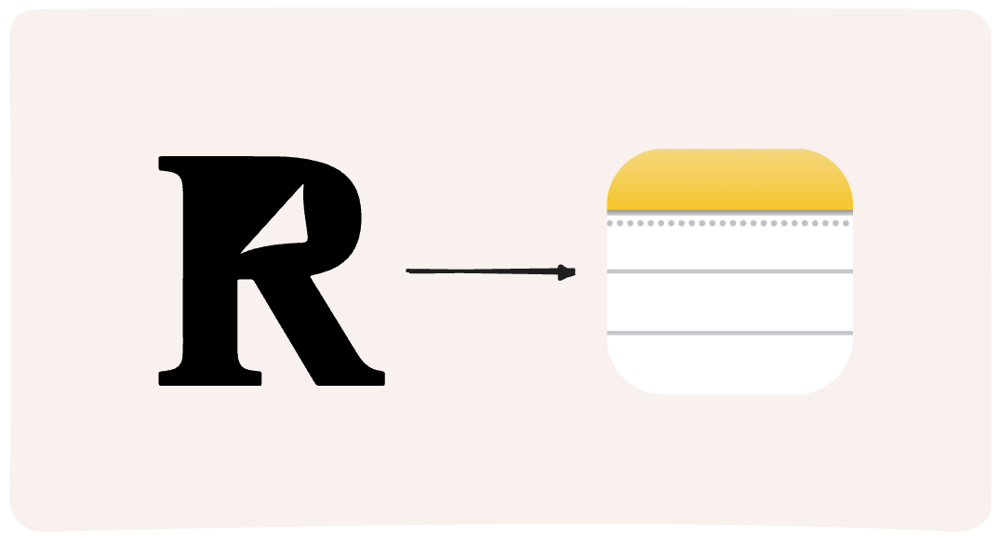

# Sample Integration: Readwise Highlights to Apple Notes



## About the Integration

This Readwise integration syncs Readwise highlights to Apple Notes. This integration was built using AppleScript.

## Running Locally

1. Setup your local project

```bash
# Clone this repository locally

git clone https://github.com/Scarvy/readwise-reader-api.git

# Switch into this project
cd readwise-reader-api/examples/readwise-apple-notes-sync

npm install
```

2. Set your environment variables in a `.env` file

```txt
READWISE_TOKEN=<readwise-personal-access-token>
```

You can create your Readwise API key [here](https://readwise.io/access_token)

3. Run code

```bash
ts-node index.ts
```
